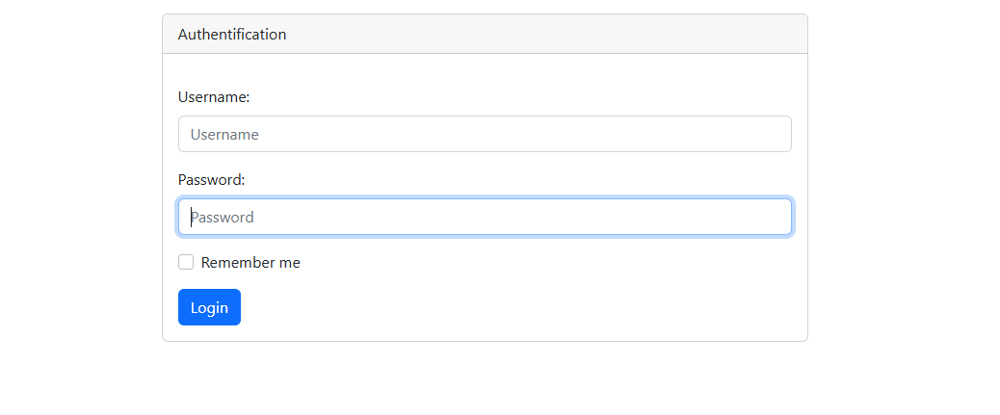
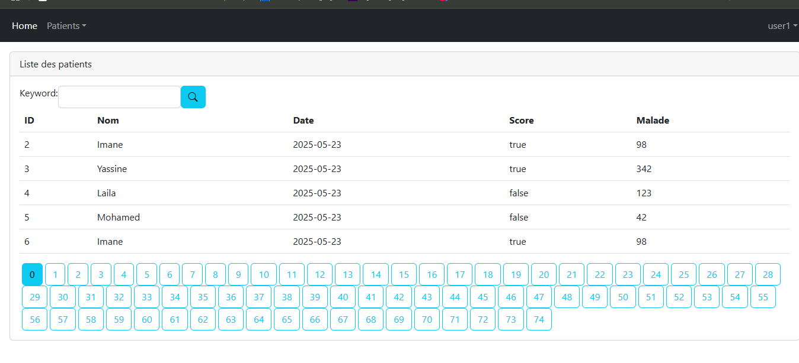
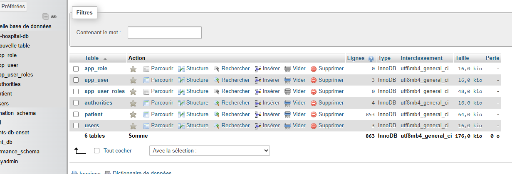
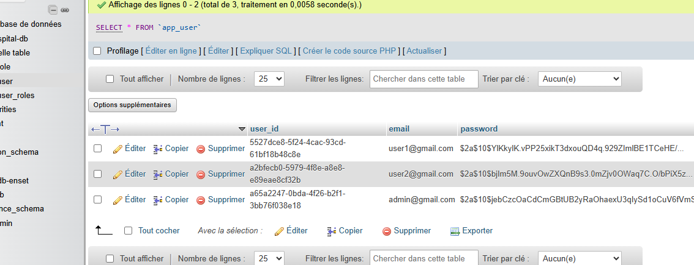

# Rapport de Projet : Application de Gestion des Patients avec Sécurité

## Introduction

Ce projet consiste en la réalisation d’une application web pour la gestion des patients dans un environnement hospitalier.  
L’objectif principal est de fournir une interface sécurisée pour gérer les données des patients, tout en assurant la confidentialité et l’intégrité des informations.

Voici une capture d’écran de la page d’accueil de l’application :

---

## Objectifs

- Développer une application web fonctionnelle permettant de gérer les patients (ajout, modification, suppression, consultation).
- Implémenter un système d’authentification et d’autorisation sécurisé pour protéger l’accès aux données.
- Assurer une expérience utilisateur simple et intuitive.

---

## Fonctionnalités

### Gestion des patients

- Création d’un nouveau patient avec validation des champs : nom, prénom, date de naissance, téléphone, email, etc.
- Modification des informations des patients existants.
- Consultation et recherche des patients.
- Suppression sécurisée des patients.

---

### Sécurité

- Mise en place d’une authentification via Spring Security.
- Protection des routes selon les rôles utilisateurs (admin, utilisateur standard).
- Gestion des sessions et prévention des accès non autorisés.

---

## Architecture technique

L’application est développée selon l’architecture **Modèle-Vue-Contrôleur (MVC)**, favorisant la séparation des responsabilités :

- **Modèle** : gestion des entités patient, utilisateur, rôles, etc.
- **Vue** : pages web générées via Thymeleaf.
- **Contrôleur** : gestion des requêtes HTTP et de la logique métier.

---

## Technologies utilisées

- **Langage** : Java 17
- **Framework** : Spring Boot (Web, Security, Data JPA)
- **Base de données** : MySQL
- **Moteur de templates** : Thymeleaf
- **Outils** : Maven pour la gestion des dépendances, Git pour le versionning.

---

## Déploiement et utilisation

1. Cloner le dépôt GitHub du projet.
2. Configurer la base de données MySQL et importer le schéma.
3. Modifier les paramètres de connexion dans `application.properties`.
4. Lancer l’application via la classe principale Spring Boot.
5. Accéder à l’application via `http://localhost:8080`.

---

## captures d'ecran:

---

## Conclusion

Ce projet a permis de mettre en pratique les concepts de développement web sécurisés avec Spring Boot, ainsi que la gestion d’une base de données relationnelle.  
L’application est fonctionnelle et sécurisée, mais pourrait être enrichie avec de nouvelles fonctionnalités pour répondre aux besoins évolutifs d’un environnement hospitalier.

---

